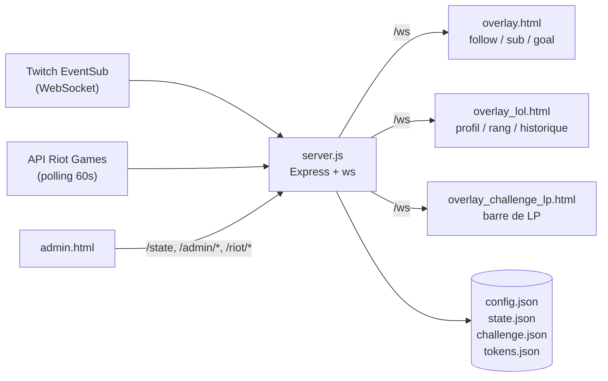

# Overlay Twitch — Subs / Followers / Sub Goal / Challenge LoL


Serveur Node.js local qui écoute les événements Twitch en temps réel (EventSub WebSocket) et pousse les mises à jour vers des pages overlay ajoutées dans OBS via **Browser Source**. Inclut aussi **Challenge LoL**, un module optionnel qui suit un compte League of Legends via l'API Riot Games (rang, LP, historique de parties) pour habiller un challenge de rank en direct.

Aucun fichier `.env` à éditer manuellement pour la partie Twitch : au premier lancement, le serveur ouvre automatiquement un assistant de configuration dans le navigateur. Distribué aux streamers sous forme d'un `.exe` unique — pas de Node.js à installer côté utilisateur final.

---

## Sommaire

- [Fonctionnalités](#fonctionnalités)
- [Pour qui ?](#pour-qui-)
- [Installation développeur](#installation-développeur)
- [Challenge LoL (optionnel)](#challenge-lol-optionnel)
- [Construire un .exe](#construire-un-exe)
- [Architecture technique](#architecture-technique)
- [Pistes d'extension](#pistes-dextension)
- [Dépannage](#dépannage)
- [Licence](#licence)

---

## Fonctionnalités

- 🔔 **Alertes follow / sub / gift-sub en temps réel** via Twitch EventSub (WebSocket), sans polling.
- 🎯 **Objectif de subs** configurable avec animation de célébration à l'atteinte du goal.
- 💬 **Messages personnalisables** (follow, sub, objectif atteint) avec placeholder `{name}`.
- 🕹️ **Panneau d'administration** pour simuler des événements, ajuster les compteurs et l'apparence sans toucher au code.
- 🏆 **Challenge LoL** (optionnel) : rang Solo/Duo, ratio victoires/défaites, barre de progression LP avec paliers configurables, historique des 10 dernières parties classées.
- 📦 **Distribution en un seul `.exe`** (via `pkg`) : le streamer n'installe rien, juste un double-clic.
- 🇫🇷 **Interface entièrement en français**, pensée pour des streamers non-développeurs.

---

## Pour qui ?

| | 🎮 Streamer | ⚙️ Développeur |
|---|---|---|
| **Objectif** | Déployer l'overlay sans toucher au code | Personnaliser, étendre ou contribuer |
| **Point de départ** | [Construire et distribuer un .exe](#construire-un-exe) | [Installation développeur](#installation-développeur) |
| **Prérequis** | Aucun — Node.js est embarqué dans l'exe | Node.js 18+, OBS Studio |

---

## Installation développeur

### 1. Créer une application Twitch

1. Rendez-vous sur [dev.twitch.tv/console/apps](https://dev.twitch.tv/console/apps) et connectez-vous.
2. Cliquez sur **Register Your Application**.
   - **Name** : au choix (ex. `MonOverlaySubs`)
   - **OAuth Redirect URLs** : `http://localhost:3000/auth/callback`
   - **Category** : `Application Integration`
3. Notez le **Client ID**.
4. Cliquez sur **New Secret**, notez le **Client Secret** — il ne sera plus affiché ensuite.

### 2. Démarrer le serveur

```bash
cd twitch-overlay
npm install
npm start
```

Au premier lancement, le navigateur s'ouvre sur l'assistant de configuration (`/setup.html`). Renseignez le Client ID, le Client Secret et votre pseudo Twitch : le broadcaster ID est résolu automatiquement via l'API Twitch. Après validation, Twitch demande d'autoriser l'application, puis l'utilisateur est redirigé vers le panneau d'administration.

La configuration est sauvegardée dans `config.json` (généré automatiquement). Le setup n'est à refaire qu'en cas de suppression de ce fichier.

### 3. Tester sans attendre un événement réel

Accédez à **[http://localhost:3000/admin](http://localhost:3000/admin)** pour :

- Simuler un follow, un sub ou réinitialiser les compteurs
- Définir l'objectif de subs
- Personnaliser les messages de remerciement (`{name}` est remplacé par le pseudo)
- Choisir la couleur d'accent, la couleur du texte et la forme des panneaux

Gardez `overlay.html` ouvert dans un onglet séparé pour visualiser les animations en direct.

### 4. Ajouter l'overlay dans OBS

L'overlay couvre l'intégralité du canvas (1920 × 1080) : les compteurs sont ancrés en haut à gauche, et les annonces de follow/sub s'affichent **au centre de l'écran**, en texte seul sans fond (contour sombre pour la lisibilité sur n'importe quel arrière-plan).

1. Dans OBS : **+** → **Source de navigateur (Browser Source)**
2. **URL** : `http://localhost:3000/overlay.html`
3. **Largeur** : `1920` — **Hauteur** : `1080` (adapter à votre canvas si différent)
4. Cochez **Actualiser le navigateur quand la scène devient active**
5. Positionnez la source en `0, 0`
6. Le fond est nativement transparent — aucun chroma key nécessaire.

---

## Challenge LoL (optionnel)

Deuxième scène OBS dédiée à un challenge de rank League of Legends, avec deux widgets indépendants alimentés par l'API Riot Games :

- **`overlay_lol.html`** — widget League of Legends (profil, rang + LP, ratio victoires/défaites, historique des 10 dernières parties classées Solo/Duo).
- **`overlay_challenge_lp.html`** — barre verticale de progression LP avec des paliers configurables (ex. Diamant IV → Master), animée quand un palier est franchi.

### 1. Créer un fichier `.env`

Copiez `.env.example` en `.env` (à la racine en dev, **à côté de l'exe** en production) et renseignez :

```
RIOT_API_KEY=...
RIOT_GAME_NAME=VotrePseudo
RIOT_TAG_LINE=EUW
RIOT_PLATFORM=euw1
```

- Clé API sur [developer.riotgames.com](https://developer.riotgames.com/) — une clé de développement (gratuite) expire toutes les 24h et doit être régénérée manuellement ; une clé personnelle ne expire pas mais nécessite une demande d'approbation (~2 semaines).
- Sans ce fichier, les deux widgets restent inactifs mais le reste de l'overlay (Twitch) fonctionne normalement.

### 2. Configurer le challenge dans l'admin

Onglet **Challenge LoL** de `/admin` :
- Ajoutez vos paliers (tier, division, LP, libellé optionnel) dans la carte "Paliers".
- Cliquez sur **Démarrer / Réinitialiser le challenge** au moment de commencer (les parties jouées avant ce clic ne sont pas comptées).
- Utilisez les boutons ±1 victoire/défaite pour corriger manuellement le compteur en cas de game jouée hors stream.

### 3. Ajouter les widgets dans OBS

Comme pour `overlay.html`, ajoutez chaque page comme sa propre **Browser Source** (déplaçable indépendamment) :
- `http://localhost:3000/overlay_lol.html` — 560 × 170
- `http://localhost:3000/overlay_challenge_lp.html` — 300 × 940

---

## Construire un .exe

Le projet utilise [pkg](https://github.com/vercel/pkg) pour empaqueter Node.js, le serveur et les pages HTML dans un seul exécutable — sans dépendance à installer côté utilisateur final.

```bash
npm install
npm run build:win   # Windows
npm run build:mac   # macOS
npm run build:all   # les deux
```

Cela génère `dist/OverlayTwitch.exe` (≈ 40 Mo, Node.js est embarqué).

**Fichiers à transmettre au streamer :**
- `dist/OverlayTwitch.exe`
- `LISEZ-MOI.txt` — notice en français (à adapter depuis les sources fournies)
- `.env` (optionnel, uniquement pour le Challenge LoL) — copié à côté de l'exe

**Comportement de l'exécutable :**
- **Premier lancement** : ouvre l'assistant de configuration dans le navigateur.
- **Lancements suivants** : ouvre directement le panneau d'administration (ou la page d'autorisation Twitch si elle n'a pas encore été effectuée).
- `config.json`, `state.json`, `tokens.json` et `challenge.json` sont créés **à côté de l'exe** — la configuration et les compteurs survivent aux redémarrages.

> **Note Windows** — L'exe n'étant pas signé par un certificat commercial, Windows SmartScreen peut afficher un avertissement au premier lancement. Cliquez sur **Informations complémentaires** → **Exécuter quand même**. Ce comportement est standard pour tout exécutable non signé.

---

## Architecture technique



| Fichier | Rôle |
|---|---|
| `server.js` | Serveur Express + WebSocket local, connexion EventSub Twitch |
| `public/overlay.html` | Canvas 1920 × 1080 rendu dans OBS, animé via WebSocket |
| `public/admin.html` | Panneau de contrôle (simulation, messages, apparence) |
| `public/setup.html` | Assistant de configuration initiale |
| `public/overlay_lol.html` | Widget League of Legends (profil, rang, ratio, historique de parties) |
| `public/overlay_challenge_lp.html` | Widget barre LP avec paliers du Challenge LoL |
| `config.json` | Client ID/Secret, broadcaster ID, préférences visuelles |
| `state.json` | Compteurs persistants (followers, subs, objectif) |
| `tokens.json` | Tokens OAuth Twitch (rafraîchis automatiquement) |
| `.env` | Clé API Riot + compte suivi pour le Challenge LoL (optionnel) |
| `challenge.json` | Compteurs et paliers persistants du Challenge LoL |

**Flux de données :**
1. Twitch envoie un événement via `wss://eventsub.wss.twitch.tv/ws`
2. `server.js` met à jour l'état et diffuse un message sur le WebSocket local (`/ws`)
3. `overlay.html` reçoit le message et anime le compteur ou affiche le toast d'alerte

---

## Pistes d'extension

- **Resub** — abonner `channel.subscription.message` pour afficher les messages de resub.
- **Paliers de sub goal** — effets visuels différenciés à 50 %, 75 %, 100 %.
- **Audio** — déclencher un élément `<audio>` en JS sur les événements `sub` et `follow`.
- **Multi-scène** — variantes compact / large de `overlay.html` pour différentes scènes (starting soon, in game, brb…).
- **Alertes étendues** — `channel.raid` et `channel.cheer` pour un widget d'alertes complet.

---

## Dépannage

| Symptôme | Solution |
|---|---|
| Rien ne s'affiche dans l'overlay OBS | Vérifiez que `npm start` est toujours actif dans le terminal et que l'URL dans OBS est exactement `http://localhost:3000/overlay.html`. |
| Erreur à `/auth/callback` | Vérifiez que l'URL de redirection configurée dans la console dev Twitch est exactement `http://localhost:3000/auth/callback`. |
| Les événements Twitch n'arrivent pas | Consultez les logs du terminal — Twitch renvoie le motif d'échec de l'abonnement EventSub en clair (problème de scope OAuth dans la majorité des cas). |
| Le port 3000 est déjà utilisé | Une autre instance du programme est peut-être active. Fermez-la ou redémarrez la machine. |

---

## Licence

Distribué sous licence [MIT](LICENSE). Le code est libre d'utilisation, de modification et de redistribution.
